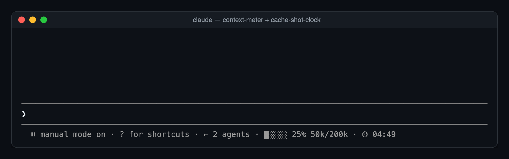
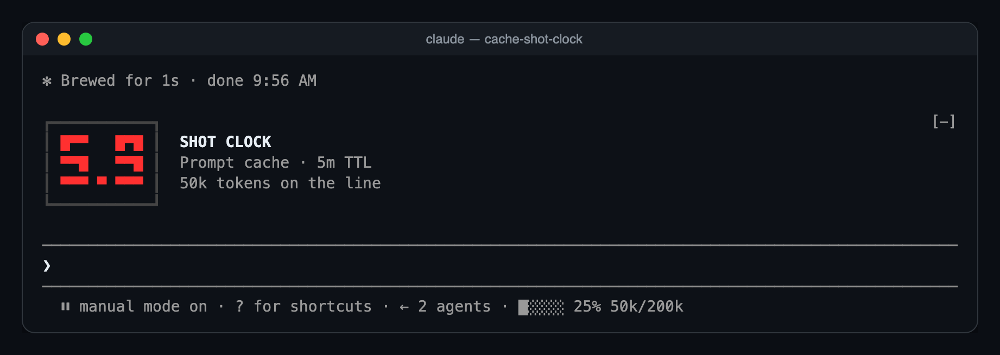
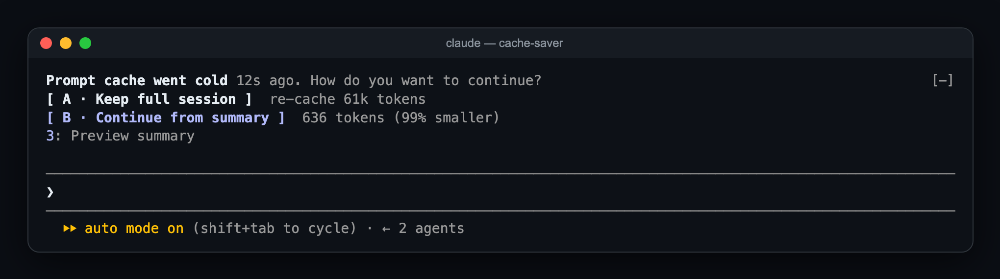

# mods

Mods for [Claude Code](https://claude.com/claude-code): small plugins that add what the terminal UI doesn't show you, like how full your context is and when your prompt cache is about to expire.


| Mod | What it does |
| --- | --- |
| [cache-shot-clock](./cache-shot-clock) | A countdown to when your prompt cache expires and the next turn pays a full cache write. Small in the bar under the prompt, then a big LED shot clock for the last 15 seconds. |
| [context-meter](./context-meter) | A five-cell meter in the same bar: how full the context window is, with the percent and token counts. |
| [cache-saver](./cache-saver) | Summarizes an idle session while its cache is still warm. When you come back, pick: keep the full session (and re-cache it) or continue from the summary. |

## What it looks like

Both bar mods share one line under the prompt:



With 15 seconds left, the shot clock takes over:



And when you come back to a cold cache, cache-saver asks how to continue:



## Install

You need Claude Code 2.1.287 or newer.

```sh
git clone https://github.com/cjavdev/mods.git ~/mods
```

**Try them in one session:**

```sh
claude --plugin-dir ~/mods/cache-shot-clock --plugin-dir ~/mods/context-meter --plugin-dir ~/mods/cache-saver
```

**Load them in every session:** add the folders to `CLAUDE_CODE_PLUGIN_DIRS` in the `env` block of `~/.claude/settings.json`, separated by `:`.

```json
{
  "env": {
    "CLAUDE_CODE_PLUGIN_DIRS": "~/mods/cache-shot-clock:~/mods/context-meter:~/mods/cache-saver"
  }
}
```

## Turn one off

Every mod has an **Enabled** row in `/config`, next to its other settings. Or set it in `~/.claude/settings.json`:

```json
{
  "pluginConfigs": {
    "cache-saver": { "options": { "enabled": false } }
  }
}
```

Each mod's README lists its settings.

> These mods use Claude Code's function-hooks API, which is early access and may change between releases. They were built and tested on Claude Code 2.1.287. The bar under the prompt is drawn by the terminal only for now.
