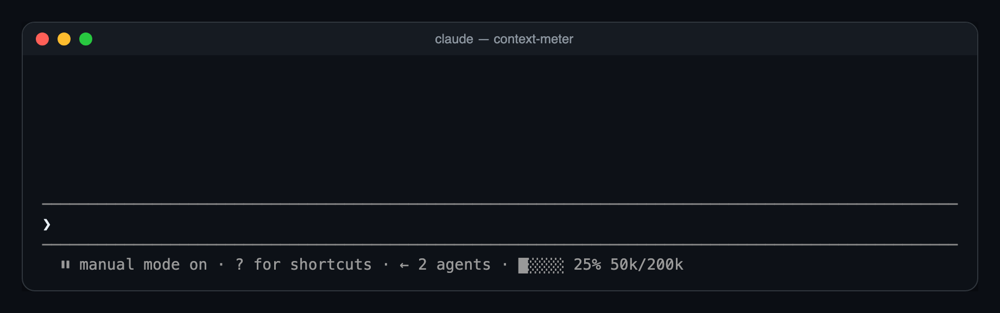
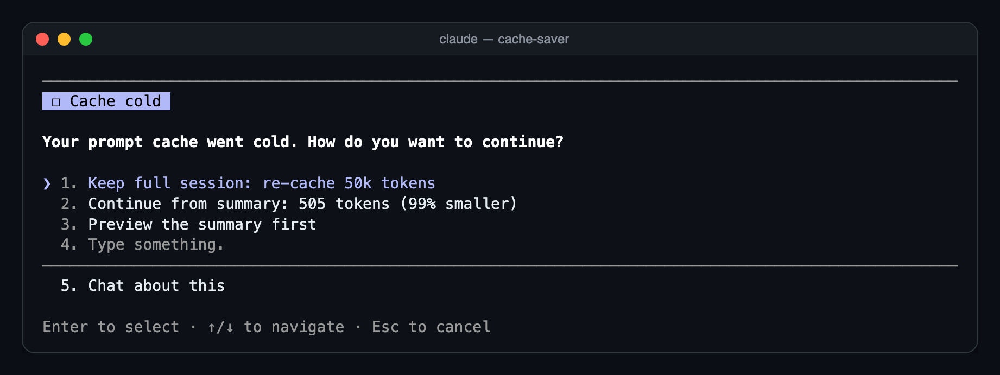

# mods

Mods for [Claude Code](https://claude.com/claude-code): small plugins that add what the terminal UI doesn't show you, like how full your context is and when your prompt cache is about to expire.


- [cache-shot-clock](#cache-shot-clock): a countdown to when your prompt cache expires
- [context-meter](#context-meter): how full the context window is
- [cache-saver](#cache-saver): pick up an idle session from a summary instead of re-caching it

## cache-shot-clock

A countdown to when your prompt cache expires and the next turn pays a full cache write. It's a small clock in the bar under the prompt, then a big LED shot clock for the last 15 seconds.

[README and source →](./cache-shot-clock)


| Setting | Default | |
| --- | --- | --- |
| `enabled` | `true` | Turns the clock off without unloading the mod. |
| `bigAt` | `15` | Seconds left when the big LED clock appears. `0` keeps the clock in the bar. |
| `ttl` | `auto` | `auto`, `5m` or `1h`. Forces the countdown length instead of reading it from the transcript. |
| `warnSeconds` | `60` | When to toast before an idle cache expires. `0` turns the toast off. |
| `testTtlSeconds` | `0` | For testing: count down from this many seconds instead of the real TTL. |

## context-meter

A five-cell meter in the bar under the prompt: how full the context window is, with the percent and the token counts. You can see a `/compact` coming before it happens.

[README and source →](./context-meter)



| Setting | Default | |
| --- | --- | --- |
| `enabled` | `true` | Turns the meter off without unloading the mod. |

## cache-saver

Summarizes an idle session while its cache is still warm. When you come back to a cold cache, a menu asks: keep the full session and re-cache it, or continue from the summary.

[README and source →](./cache-saver)



| Setting | Default | |
| --- | --- | --- |
| `enabled` | `true` | Turns the mod off without unloading it. |
| `ttl` | `auto` | `auto` reads the TTL from the transcript; `5m` or `1h` forces it. |
| `leadSeconds` | `45` | How long before the idle cache expires to build the summary. |
| `minTokens` | `30000` | Sessions smaller than this get no summary. |
| `testTtlSeconds` | `0` | For testing: treat the cache as expiring after this many seconds. |

## Install

You need Claude Code 2.1.287 or newer.

```sh
git clone https://github.com/cjavdev/mods.git ~/mods
```

**Try them in one session:**

```sh
claude --plugin-dir ~/mods/cache-shot-clock --plugin-dir ~/mods/context-meter --plugin-dir ~/mods/cache-saver
```

**Load them in every session:** add the folders to `CLAUDE_CODE_PLUGIN_DIRS` in the `env` block of `~/.claude/settings.json`, separated by `:`.

```json
{
  "env": {
    "CLAUDE_CODE_PLUGIN_DIRS": "~/mods/cache-shot-clock:~/mods/context-meter:~/mods/cache-saver"
  }
}
```

## Changing settings

Every setting above is a row in `/config`. Or set it under the mod's name in `~/.claude/settings.json`:

```json
{
  "pluginConfigs": {
    "cache-shot-clock": { "options": { "bigAt": 30 } },
    "cache-saver": { "options": { "enabled": false } }
  }
}
```

> These mods use Claude Code's function-hooks API, which is early access and may change between releases. They were built and tested on Claude Code 2.1.287. The bar under the prompt is drawn by the terminal only for now.
