# ant-farm (prototype)

A [Claude Code](https://claude.com/claude-code) mod for tending your [Claude Managed Agents](https://platform.claude.com/docs/en/managed-agents/overview) without leaving the terminal. It drives the `ant` CLI, so it sees whatever `ant auth status` sees.

This is a brainstorm you can run: ten agent-management experiences, each built far enough to try. Pick the ones worth finishing.

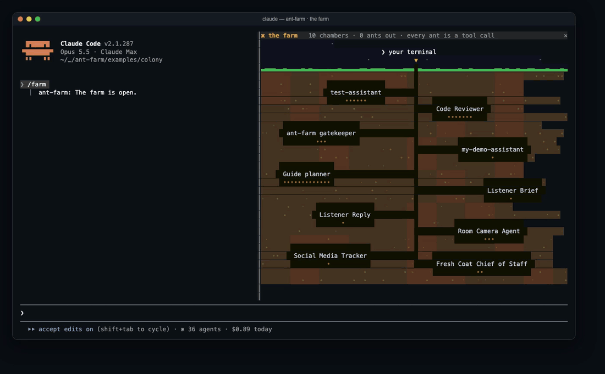

<sub>Every capture on this page is the mod running in a real Claude Code session against a real account: real agents, real sessions, real `ant` output. Nothing is mocked.</sub>

## Try it

You need Claude Code 2.1.287 or newer and `ant` 1.30 or newer, logged in (`ant auth login`).

```sh
git clone https://github.com/cjavdev/mods.git ~/mods
claude --plugin-dir ~/mods/ant-farm
```

Then `/fleet`, `/board`, `/replay <agent>`, `/farm`, or type `@<agent> <question>`.

## The ten experiences

### 1. The colony bar and mission control

Your fleet is always in the corner of your eye: how many agents, how many are live, how many are waiting on you, what you have spent today, and when the next scheduled run fires. It sits in the bar under the prompt, beside the context meter and the shot clock.

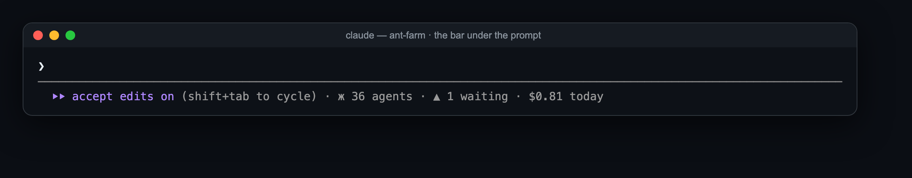

`/fleet` opens mission control: every agent that has run, its model and version, how often it ran over the last 26 weeks, what it cost, and when it last ran. It also says how many agents never ran and how many share a name, which is where cleanup starts. A number key opens one agent: its system prompt, its sessions, its schedules.

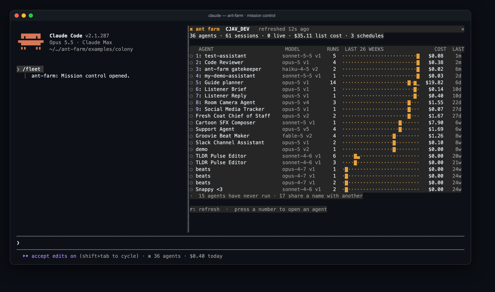

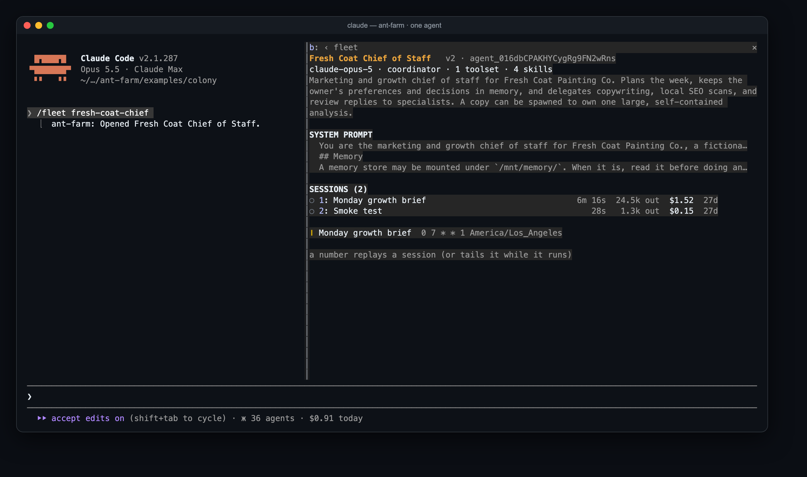

How: three `ant beta:… list` calls on a timer, a `PromptHint` tail, and a `Pane`.

### 2. Session TV

`/tail <agent or session>` puts a cloud session in a pane beside your work: its thinking, its tool calls, its messages as they are typed. The field at the bottom sends it a message, and `i` interrupts it.

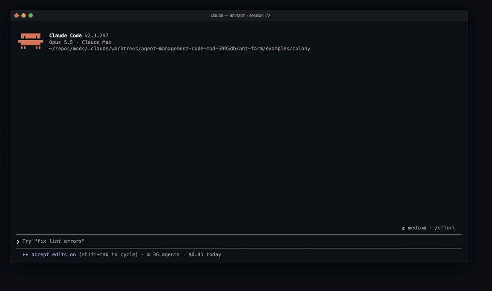

How: `ant beta:sessions:events stream --event-delta agent.message` held open with `$.process.spawn`, and `events send` for your side.

### 3. @agent

Type `@code-reviewer is this a bug?` in the prompt box. The question goes to that cloud agent instead of the local model, and its reply lands in the transcript as a card that fills in as the agent types. A second `@code-reviewer …` continues the same session. Claude reads each reply too, so you can follow up with "apply what the reviewer said".

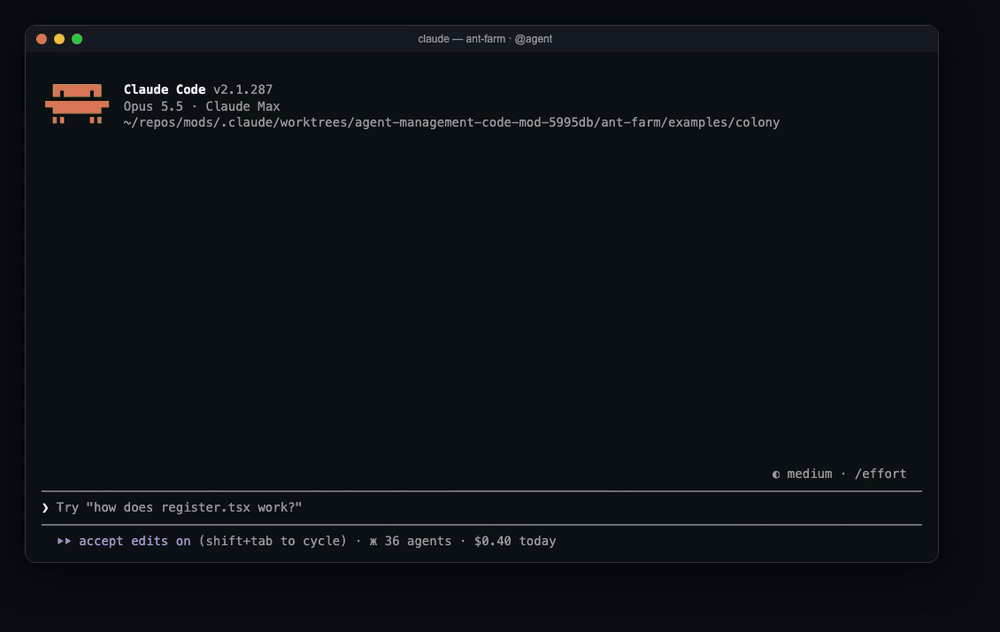

How: a `prompt.submit` hook takes the mention, `/ask` leaves a `CommandOutput` row, and a `ui.render` hook draws the card from the live feed.

### 4. Dispatch and wake

Claude gets a `dispatch` tool. Say "have my Code Reviewer look at this while you keep going" and Claude hands the task to the cloud agent, carries on with you, and is woken with the report when the agent finishes. A line above the prompt shows what the cloud agent is doing in the meantime and what it has cost so far.

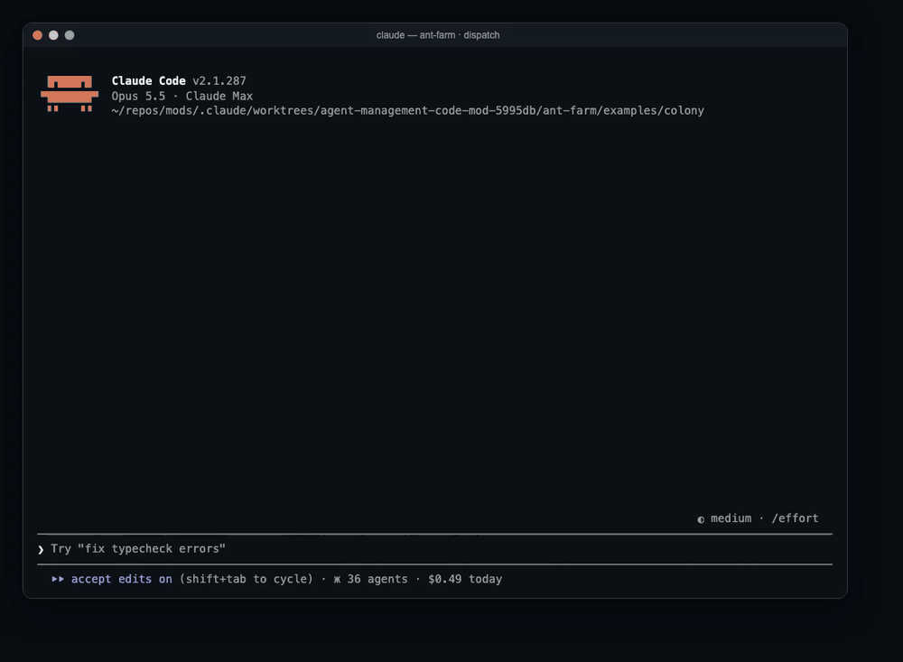

How: `$.tool.register`, a `tool.call` hook that creates the session, and `$.prompt.submit` when the stream says `end_turn`.

### 5. The approval inbox

When a cloud agent's tool call needs a person (`always_ask`, or `auto` with no verdict), a band appears above your prompt with the tool and its input. `1` allows it and `2` denies it. The bar shows how many are waiting.

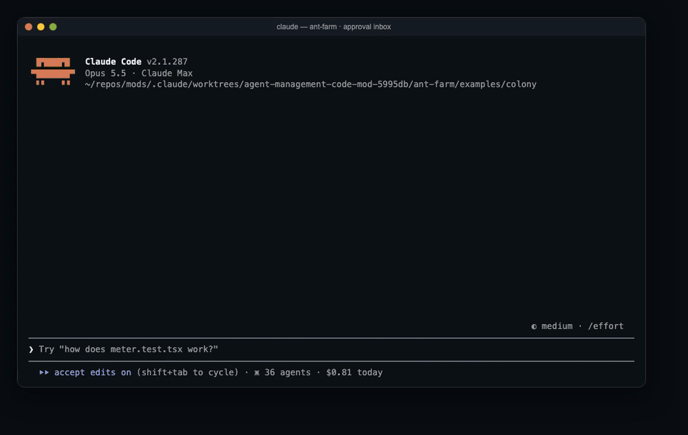

How: the stream's `agent.tool_use` events with `evaluated_permission: ask`, answered with a `user.tool_confirmation` event.

### 6. The plan gate

Agents as code. When Claude (or you, through Claude) edits a file that `ant apply` reads, the mod runs `ant apply --dry-run` and shows the plan above the prompt: what would be created or updated, with the changed words of a system prompt in green. `1` applies it.

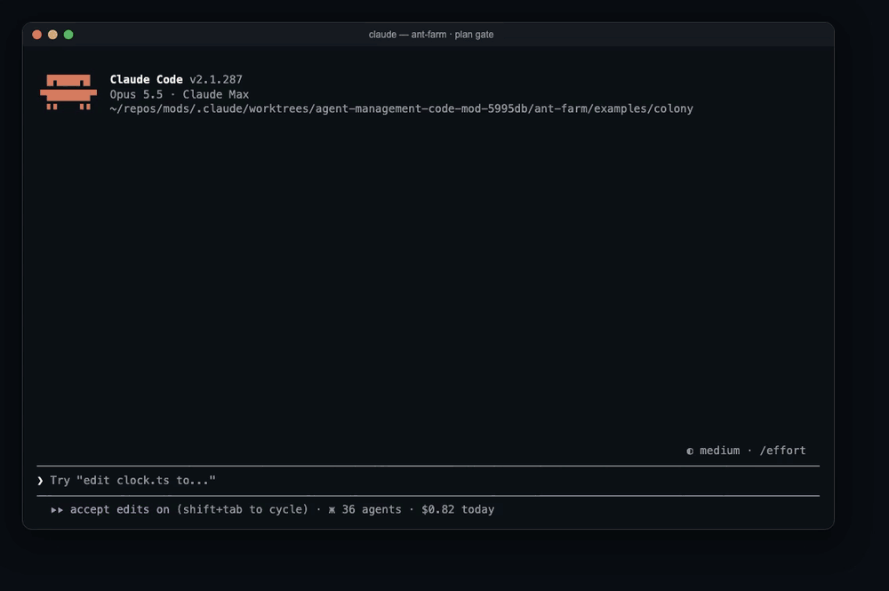

A file with nothing behind it yet plans as a create, with every field it would send:

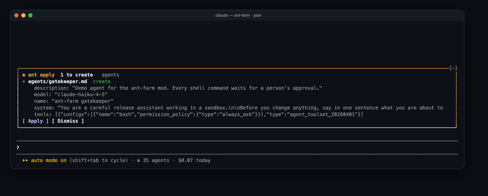

How: a `tool.call` hook on `Edit` and `Write`, `ant apply --dry-run`, and `ant apply --yes` behind the Apply button. `/antplan` plans by hand.

### 7. The schedule board

`/board` lists your scheduled deployments: the next run in your time zone with a countdown, the last run and what it cost, a 14-day strip with a mark for each run, and the prompt each run starts with. Run now and pause or unpause are a key each, behind a confirmation.

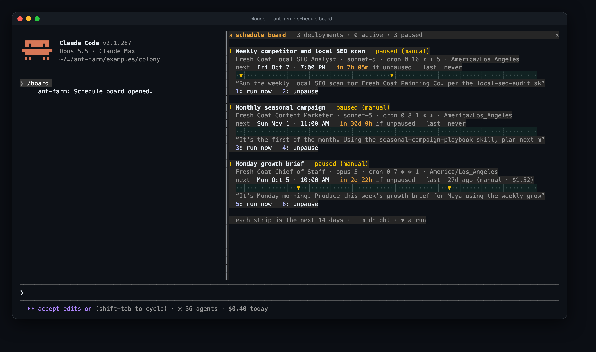

How: `ant beta:deployments list`, `beta:deployment-runs list`, and a one-row `Raster` per strip.

### 8. The flight recorder

`/replay <agent or session>` loads a finished session as a timeline: one lane per agent thread, colored by what was happening (model, tool, another agent, error), with totals for time, requests, tool calls, tokens and cost. `j` and `k` step through it and `p` plays it back. "Debug with Claude" hands the whole record to Claude and asks where it went wrong and what to change in the agent.

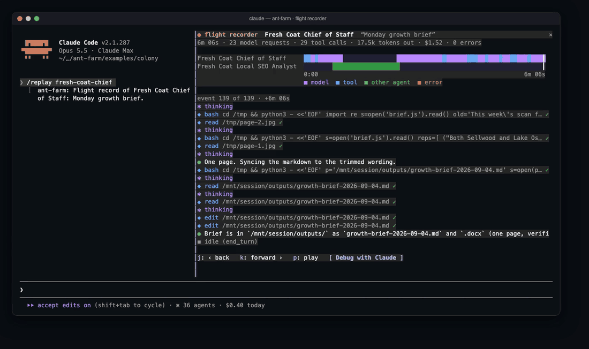

How: `ant beta:sessions:events list`, `Raster` lanes, and `$.prompt.submit` for the debug hand-off.

### 9. The bake-off

`/bakeoff <agent> <agent> <prompt>` sends the same prompt to two agents and shows the answers side by side as they arrive, with time, tokens and cost for each. Pick the winner with `1` or `2`.

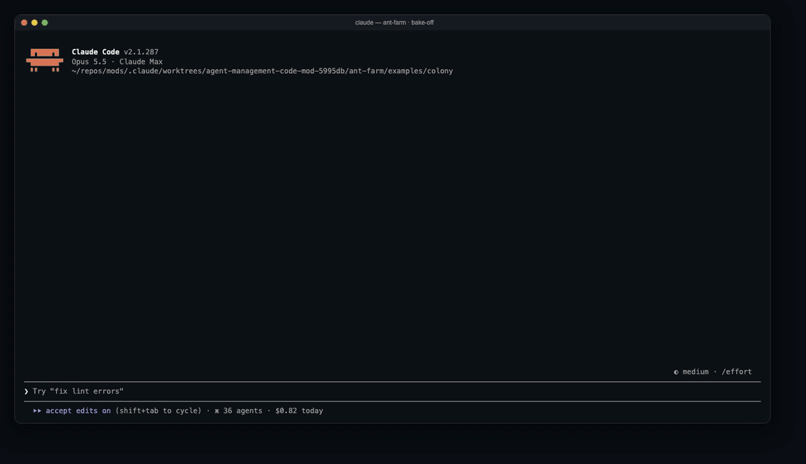

How: two sessions started together, two feeds, one `Pane`.

### 10. The farm

`/farm` is the fleet as an ant farm. Each agent that has run gets a chamber, with a pellet for each session. When a session is live its chamber lights up, and every tool call is an ant that walks up the tunnel to the surface and carries the result back. Your messages go down as white ants and the agent's replies come up as green ones.

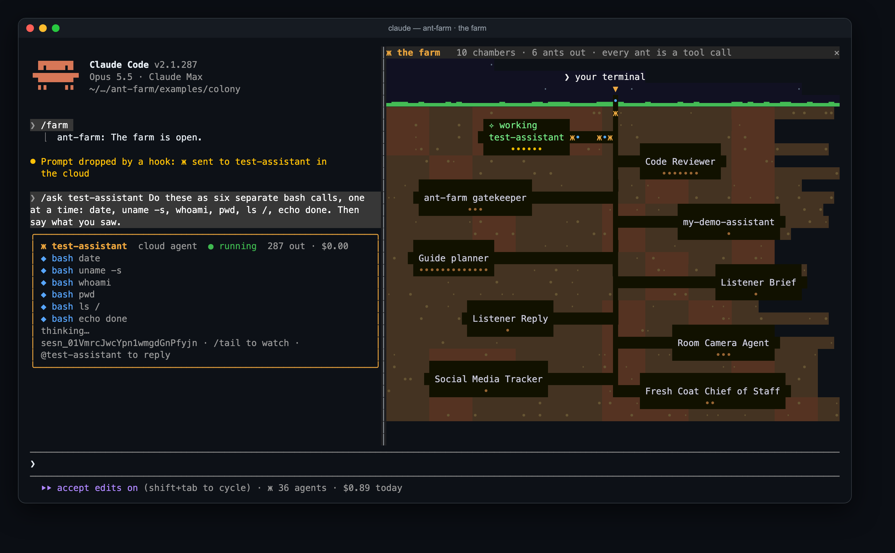

How: one `Raster`, redrawn seven times a second from the same live feeds the other views use.

## What works and what does not, yet

| | Works in the prototype | Not yet |
| --- | --- | --- |
| Bar and mission control | Live counts, cost, 26-week activity, agent detail | It re-reads everything every 30 seconds; no paging past 200 |
| Session TV | Live stream, send, interrupt | Primary thread only |
| @agent | Ask, follow-up in the same session, Claude reads the reply | The row is left by a command the mod runs itself, so its stored text is the engine's "no hook answered" line |
| Dispatch and wake | The whole loop, with real turns | The cloud agent sees no local files; mounting the repo as a session resource is the next step |
| Approval inbox | Allow and deny for sessions the mod follows | Sessions started elsewhere; a reason typed with a deny |
| Plan gate | Plan after an edit, colored diff, apply | `--prune`, and a plan across several files at once |
| Schedule board | Everything shown | Run now and pause are wired but were not pressed for the captures |
| Flight recorder | Lanes, stepping, playback | Events of other agents' threads, which the API lists separately |
| Bake-off | Two agents, live | Two versions of one agent, and promoting the winner |
| The farm | All of it | Nothing it needs |

Ideas that did not make the ten: sending the current local session to a cloud agent to finish, a browser for memory stores and dreams, running `ant beta:worker poll` in a pane so cloud agents use your machine, and a cleanup pass for agents that never ran or share a name.

## Commands and tools

| | |
| --- | --- |
| `/fleet [agent]` | Mission control, or one agent |
| `/tail [agent or session]` | Session TV |
| `/ask <agent> <question>` | Ask a cloud agent; `@<agent> <question>` is the same |
| `/antplan [paths]` | Plan what `ant apply` would change |
| `/board` | The schedule board |
| `/replay <agent or session>` | The flight recorder |
| `/bakeoff <agent> <agent> <prompt>` | Two agents, one prompt |
| `/farm` | The farm |
| `mcp__ant-farm__agents`, `mcp__ant-farm__dispatch` | Tools Claude calls to list your agents and hand one a task |

## Settings

In `/config`, or under `pluginConfigs["ant-farm"].options` in settings:

| Option | Default | |
| --- | --- | --- |
| `enabled` | `true` | Turns the mod off without unloading it. |
| `antPath` | `ant` | The `ant` executable to run. |
| `pollSeconds` | `30` | How often the fleet is re-read. |
| `defaultEnvironment` | empty | The environment id a new session runs in when its agent has never run before. |
| `sessionBudget` | `1` | The spend cap in dollars put on every session the mod starts. |

## What it costs and what it touches

Looking is free: the bar, mission control, the board and the recorder only list and read. `/ask`, `@agent`, dispatch and bake-offs start real sessions that bill your account, each capped at `sessionBudget`. Apply, run now, pause and unpause change real resources, and each is behind a button or a confirmation.

`examples/colony/` holds the agent file the plan gate and approval captures used: a small agent whose every tool call asks first.

## Develop

```sh
claude plugin validate ~/mods/ant-farm
claude plugin test ~/mods/ant-farm
```

The captures are real sessions in tmux, saved with `tmux capture-pane -p -e`, turned into pages with [`scripts/ansi2html.py`](../scripts/ansi2html.py) and screenshotted; the animations are the same thing, many times a second.
