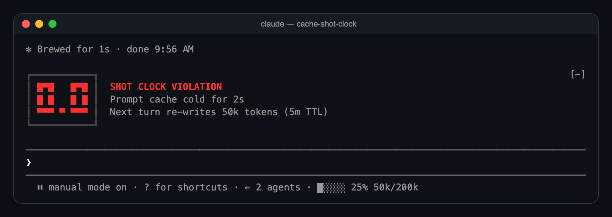

# cache-shot-clock

A [Claude Code](https://claude.com/claude-code) mod that puts a shot clock on your prompt cache: how long until it expires and your next turn pays to write the whole conversation into the cache again.


<sub>The terminal half is a real capture of the mod counting down to the buzzer. The player is fictional.</sub>

## What it shows

Most of the time, just a small clock at the end of the bar under the prompt:


With 15 seconds left, the big LED clock appears above the prompt. It counts whole seconds in amber, then tenths in red for the last ten:


At zero, the buzzer:



Ten seconds later it folds back into the bar as `⏱ 00:00`, until your next turn restarts it.

- **The clock** restarts on every model request of the main conversation. A request that reads the cache refreshes the TTL just like one that writes it. Subagent requests don't move it, since they cache their own prefixes.
- **The TTL** is 5 minutes or 1 hour. The mod reads it from the session transcript: each response records whether its cache write went to the 5-minute or the 1-hour bucket. Until the first turn ends it assumes 5 minutes.
- **The token count** on the big clock is what the next request re-sends. On a cold cache, all of it is written again at the cache-write rate (1.25× base input for 5m, 2× for 1h).
- A toast warns you when an idle cache has 60 seconds left.

A model switch, `/compact` or `/clear` resets the clock, because the new prefix has nothing cached yet.

## Install

You need Claude Code 2.1.287 or newer.

```sh
git clone https://github.com/cjavdev/mods.git ~/mods
claude --plugin-dir ~/mods/cache-shot-clock
```

To load it in every session, add the folder to `CLAUDE_CODE_PLUGIN_DIRS` in the `env` block of `~/.claude/settings.json` (separate several folders with `:`):

```json
{ "env": { "CLAUDE_CODE_PLUGIN_DIRS": "~/mods/cache-shot-clock:~/mods/context-meter" } }
```

It shares the bar with [context-meter](../context-meter), and the big clock stacks under anything else above the prompt.

The bar under the prompt is drawn by the terminal only for now. In the desktop app you get the big clock for the last 15 seconds and nothing before it.

## Settings

In `/config`, or under `pluginConfigs["cache-shot-clock"].options` in settings:

| Option | Default | |
| --- | --- | --- |
| `enabled` | `true` | Turns the clock off without unloading the mod. |
| `bigAt` | `15` | Seconds left when the big LED clock appears. `0` keeps the clock in the bar. |
| `ttl` | `auto` | `auto`, `5m` or `1h`. Forces the countdown length instead of reading it from the transcript. |
| `warnSeconds` | `60` | When to toast before an idle cache expires. `0` turns the toast off. |

### See the buzzer without waiting an hour

If your account caches for 1 hour, force a 5-minute countdown for one session:

```sh
claude --plugin-dir ~/mods/cache-shot-clock \
  --settings '{"pluginConfigs":{"cache-shot-clock":{"options":{"ttl":"5m"}}}}'
```

This changes only what the clock counts. It doesn't change how long Anthropic keeps your cache.

## How it works

[`hooks/register.tsx`](./hooks/register.tsx):

- A `turn.step` hook reads each main-thread response's usage and restarts the clock.
- A `model.fork` hook restarts it when another mod's fork reads the main prefix, such as [cache-saver](../cache-saver).
- A `classic.Stop` hook tails the transcript after each turn and reads the newest `cache_creation` bucket to find the TTL.
- A one-second `$.clock.every` tick redraws the clock and raises the warning. The last ten seconds tick every 100ms.
- A `ui.render` hook on `PromptHint` adds the small clock as the hint line's `tail`.
- A `ui.render` hook on `AbovePrompt` draws the LED panel for the last seconds.

The parsing, formatting and LED font are pure functions in [`hooks/clock.ts`](./hooks/clock.ts).

## Develop

```sh
claude plugin validate ~/mods/cache-shot-clock
claude plugin test ~/mods/cache-shot-clock
```

The tests run a whole countdown on a mocked clock: the bar clock, the big clock taking over at 15 seconds, tenths, the buzzer, and folding back.
