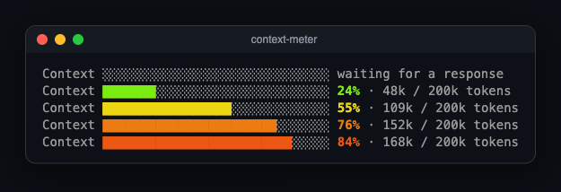
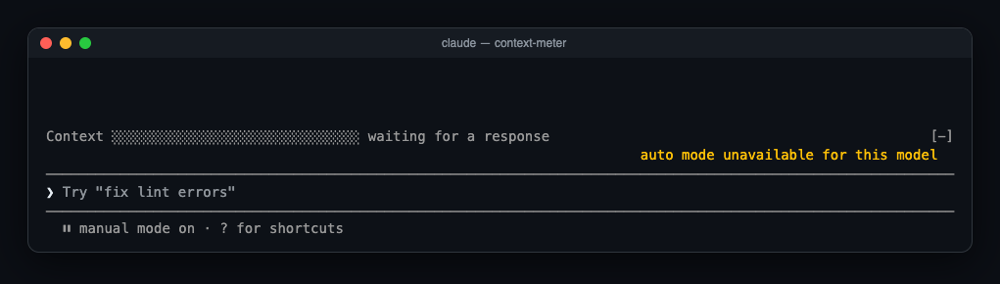
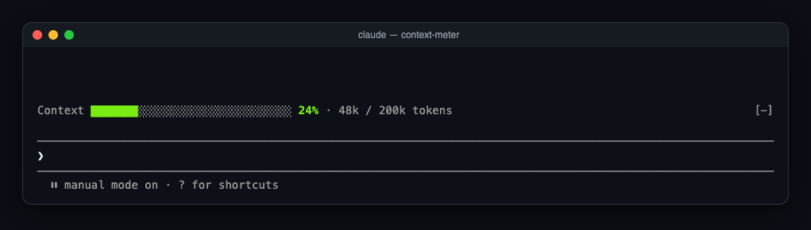
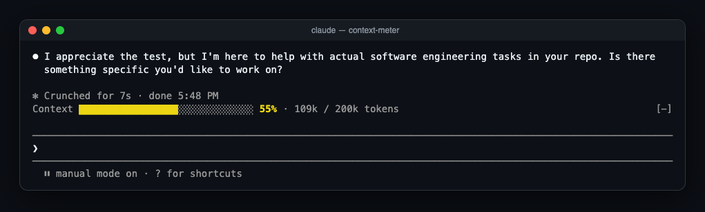
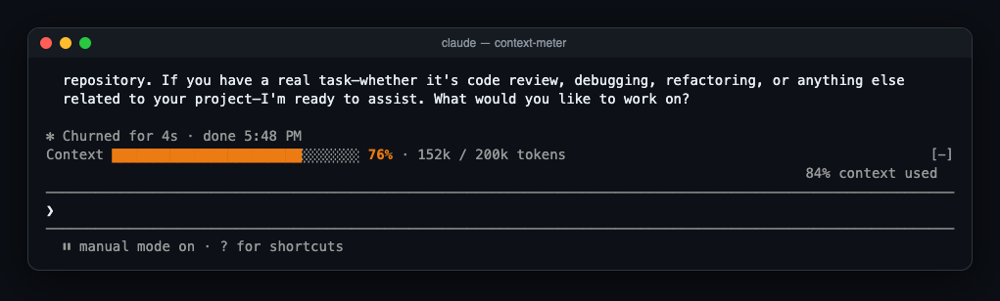
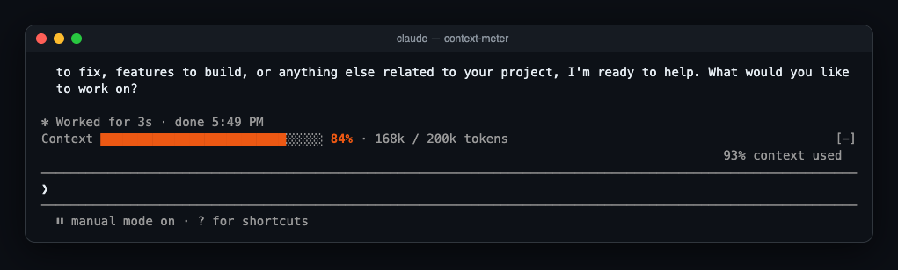
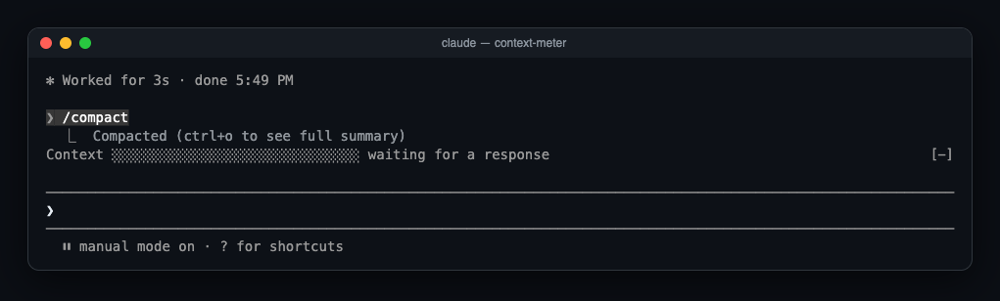
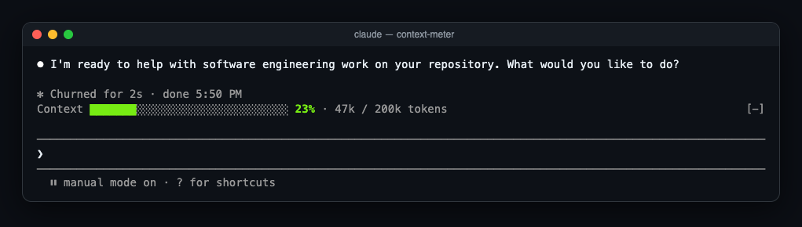

# context-meter

A [Claude Code](https://claude.com/claude-code) mod that shows how full your context window is, in a bar directly above the prompt. The bar starts green and turns yellow, orange, then red as the window fills, so you can see a `/compact` coming before it happens.



## Install

You need Claude Code 2.1.287 or newer. Clone the repo:

```sh
git clone https://github.com/cjavdev/mods.git ~/mods
```

**One session:**

```sh
claude --plugin-dir ~/mods/context-meter
```

**Every session:** add the folder to `CLAUDE_CODE_PLUGIN_DIRS` in the `env` block of `~/.claude/settings.json`:

```json
{
  "env": {
    "CLAUDE_CODE_PLUGIN_DIRS": "~/mods/context-meter"
  }
}
```

To load several plugin folders, separate them with `:`.

## What it shows

```
Context ███████████████████████░░░░░░░ 76% · 152k / 200k tokens
```

- **The bar and percentage** show input tokens from the last response divided by the model's context window. This is the same number the status line reports as `used_percentage`.
- **The color** moves along the hue wheel from green (0%) to red (100%): yellow at 50%, orange around 75%.
- **The token counts** are the tokens used and the window size, e.g. `152k / 200k`. A 1M-token model shows `/ 1M`.

The bar is 10 to 30 cells wide, depending on terminal width. Collapse the band with `[-]` or ctrl+x ctrl+a. When a survey needs the space, the meter hides until the survey closes.

### A full session

| | |
| --- | --- |
| Fresh session, before the first response |  |
| After the first reply (system prompt and tools already take 24%) |  |
| Half full: yellow |  |
| Three quarters: orange |  |
| Close to auto-compact: red-orange |  |
| Just after `/compact` (no reading until the next response) |  |
| Green again |  |

These are real captures of Claude Code 2.1.287 (Haiku 4.5, 200k window) running the mod in tmux. The context was filled by pasting filler text.

### Why it doesn't match "N% context used"

Near the top, Claude Code shows its own warning, such as `93% context used`, while the meter reads `84%`. Claude Code measures against the **auto-compact threshold**, which is a little below the full window. context-meter measures against the **full window**. As a result, auto-compact usually fires while the meter reads around 85–90%, before it reaches pure red.

## How it works

The mod is one hooks module, [`hooks/register.tsx`](./hooks/register.tsx):

- `$.session.usage()` reads the window's fill. The plain call doesn't count tokens, so it costs nothing.
- The reading is stored in session state (`$.state`, declared in [`types/index.d.ts`](./types/index.d.ts)). The band redraws whenever the reading changes.
- The reading refreshes when:
  - the session starts
  - a tool call finishes, so the bar moves mid-turn
  - `session.measure` fires; the engine pushes it after each turn
  - a 3-second timer runs, which catches a model switch, `/compact` or `/clear` between turns
- A `ui.render` hook on the `AbovePrompt` component draws the band.

The color, bar and token formatting are pure functions in [`hooks/meter.ts`](./hooks/meter.ts).

## Develop

```sh
claude plugin validate ~/mods/context-meter   # manifest and hooks check
claude plugin test ~/mods/context-meter       # runs tests/*.test.tsx
```

The tests cover the color ramp, the bar and token formatting, and the band itself. They mount the band on the terminal and desktop surfaces and check that it waits for a reading, recolors when `session.measure` reports a new fill, and hides for a survey.

To regenerate the screenshots:

1. Run the mod in a tmux session with truecolor:

   ```sh
   tmux new -e COLORTERM=truecolor "env -u TMUX claude --plugin-dir …"
   ```

2. Save the pane with `tmux capture-pane -p -e > shot.ansi`.
3. Turn the capture into an HTML page with [`scripts/ansi2html.py`](../scripts/ansi2html.py), then screenshot that page.
