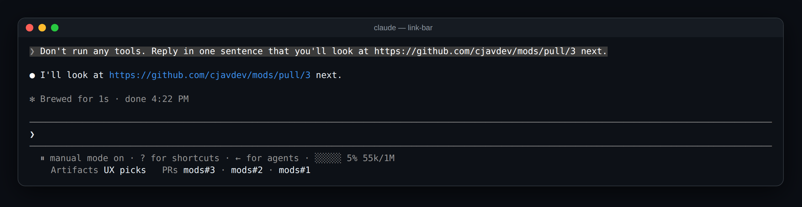

# link-bar

A [Claude Code](https://claude.com/claude-code) mod that keeps the artifacts and pull requests you've been talking about one click away. It adds a row of links under the prompt: the 3 claude.ai artifacts and the 5 GitHub pull requests mentioned most recently in the conversation.



```
  ⏸ manual mode on · ? for shortcuts · ← for agents
    Artifacts UX picks   PRs mods#3 · mods#2 · mods#1
```

- **Artifacts** are `claude.ai/artifact/…` and `claude.ai/code/artifact/…` links. One written as a markdown link, like `[UX picks](https://claude.ai/artifact/…)`, shows its label. A bare one shows the start of its id, like `artifact DhK2K2`.
- **PRs** are `github.com/<owner>/<repo>/pull/<n>` links, shown as `repo#n`.
- **Most recent first.** Mentioning a link again moves it to the front.
- **Real hyperlinks.** Each one is an OSC 8 link, so cmd-click or ctrl-click opens it in terminals that support them (iTerm2, Ghostty, kitty, WezTerm, VS Code). Elsewhere the URL is drawn after the label.

Only your prompts and Claude's replies count. Tool output (a `gh pr list`, say), system reminders and subagents' messages don't, so the row holds what the conversation was actually about. Nothing shows until the first link is mentioned.

## Install

You need Claude Code 2.1.287 or newer.

```sh
git clone https://github.com/cjavdev/mods.git ~/mods
claude --plugin-dir ~/mods/link-bar
```

Or add `~/mods/link-bar` to `CLAUDE_CODE_PLUGIN_DIRS` in the `env` block of `~/.claude/settings.json`.

It shares the space under the prompt with [context-meter](../context-meter) and [cache-shot-clock](../cache-shot-clock): they stay at the end of the hint line, and the links get the row below it.

## Settings

In `/config`, or under `pluginConfigs["link-bar"].options` in settings:

| Setting | Default | |
| --- | --- | --- |
| `enabled` | `true` | Turns the mod off without unloading it. |
| `artifacts` | `3` | How many of the most recently mentioned artifacts to link. `0` shows none. |
| `pullRequests` | `5` | How many of the most recently mentioned pull requests to link. `0` shows none. |

## How it works

The mod is one hooks module, [`hooks/register.tsx`](./hooks/register.tsx), with the link finding in [`hooks/links.ts`](./hooks/links.ts):

- A `session.append` hook sees every row the conversation keeps. For your prompts and Claude's replies on the main thread, it pulls out artifact and PR links and moves them to the front of two lists in session state (`$.state`, declared in [`types/index.d.ts`](./types/index.d.ts)). A change redraws the row.
- `--resume` and `--continue` load a conversation without appending it, so on a resume the mod reads the recent end of the transcript file and picks the links back up. `/clear` empties the lists.
- A `ui.render` hook on the `PromptHint` component draws the engine's own hint line and adds a row under it with a `Link` element per entry. The hint line's `tail` is plain text cut at the row's end, which is why the links get a row of their own.

## Develop

```sh
claude plugin validate ~/mods/link-bar   # manifest and hooks check
claude plugin test ~/mods/link-bar       # runs tests/*.test.tsx
```

The screenshot is a real capture of Claude Code running the mod (with context-meter beside it) in tmux (`tmux capture-pane -p -e`), turned into a page with [`scripts/ansi2html.py`](../scripts/ansi2html.py) and screenshotted.
