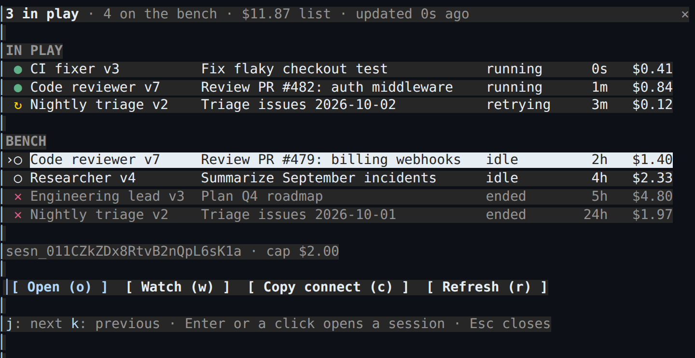
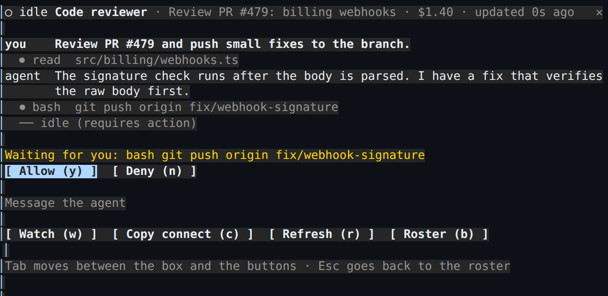
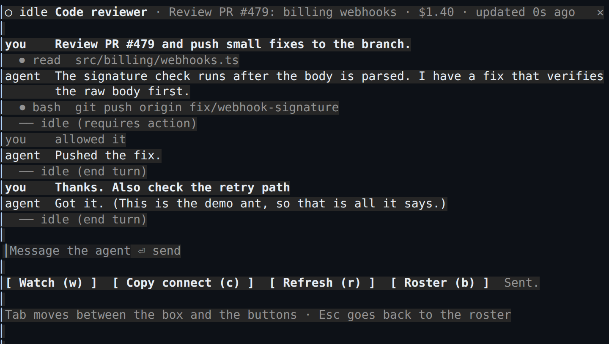
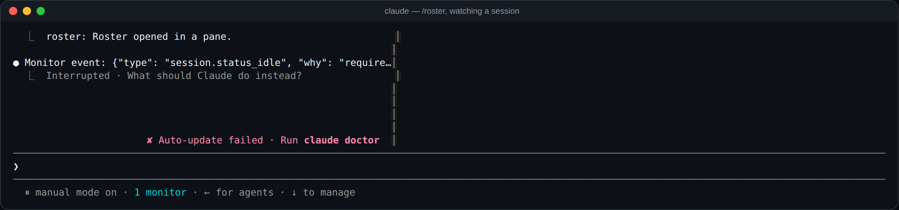
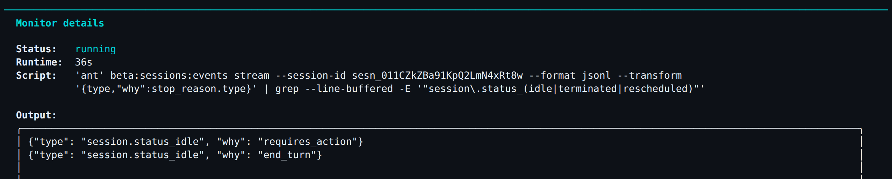

# roster

A [Claude Code](https://claude.com/claude-code) mod for keeping an eye on your [Claude Managed Agents](https://platform.claude.com/docs/en/managed-agents/overview) from the terminal you're already in. Your agents are the team and you're the coach.

## `/roster`: the team at a glance

`/roster` opens a pane with your newest sessions. The ones running or retrying are **in play**, and idle or ended ones are on the **bench**. Each row shows the agent and its version, the session title, its status, how long ago it last changed, and its list cost so far.



`/roster` takes the keyboard when it opens. If you've clicked back into the prompt, `ctrl+x tab` or a click on the pane gives it back.

- **`j` / `k`** move down and up the list. **Enter**, or a click on a row, opens that session (below).
- **`o` Open** opens the selected session.
- **`w` Watch** follows the selected session as a background task (see below).
- **`c` Copy connect** copies `ant beta:sessions connect <id>`, for following the session live in another terminal.
- **`r` Refresh** reloads the list. The pane also reloads on its own every `refreshSeconds` while it's open.
- **Esc** closes the pane.

The line under the list shows the selected session's id, deployment and budget cap.

## Opening a session

Enter on a row swaps the list for that session, in the same pane. `/roster-open <session id>` opens one directly.



The transcript shows the newest 60 events: your messages, the agent's replies, its tool calls, errors, and each time it went idle and why. It reloads every `refreshSeconds`.

- **Waiting for you** appears when the session stopped on a tool approval (`requires_action`). **`y` Allow** and **`n` Deny** answer it with a `user.tool_confirmation`.
- **The message box** sends what you type as a `user.message` when you press Enter. Tab moves between the box and the buttons.
- **`i` Interrupt** stops a running session (`user.interrupt`). It only shows while the session is running.
- **`w` Watch**, **`c` Copy connect** and **`r` Refresh** work as in the list.
- **`b` Roster** or **Esc** goes back to the list.



Each action runs `ant beta:sessions:events send --session-id <id> --event '<json>'`, then reloads the transcript.

## `/roster-watch`: one session as a background task

Claude Code has no hook for adding rows to the agents view or the tasks list. The closest a mod can get is to start a task of its own. `/roster-watch <session id>`, or `w` in the pane, runs a Monitor on the session's event stream:

```sh
ant beta:sessions:events stream --session-id <id> --format jsonl \
  --transform '{type,"why":stop_reason.type}' | grep --line-buffered -E '"session\.status_(idle|terminated|rescheduled)"'
```

It counts as one of this session's background tasks (`1 monitor` in the footer, `↓` to manage it). Each time the managed session goes idle, ends or retries, the change arrives in the transcript as a notification Claude can act on. `requires_action` means it is waiting on a tool approval, `end_turn` means it finished its turn, and `budget_reached` means it hit its cap.





Some limits to know about:

- Each status change starts a turn for Claude, so watch a few sessions you care about, not the whole team.
- A Monitor runs for at most 30 minutes (`watchMinutes`), then stops and says so.
- Backgrounding this Claude Code session (`←` for agents) stops its monitors.
- Claude Code asks before starting the monitor, the same as for any command a plugin runs.

## Install

You need Claude Code 2.1.287 or newer, and the [ant CLI](https://platform.claude.com/docs/en/cli-sdks-libraries/cli/quickstart) 1.32 or newer, logged in with `ant auth login`.

```sh
git clone https://github.com/cjavdev/mods.git ~/mods
claude --plugin-dir ~/mods/roster
```

Or add `~/mods/roster` to `CLAUDE_CODE_PLUGIN_DIRS` in the `env` block of `~/.claude/settings.json`.

### Trying it without an account

`tests/demo/ant` is a stand-in for the ant CLI that prints the sample sessions from the screenshots, a short transcript for each, and a few made-up status events. It answers what you send with a canned reply and keeps it in your temp folder. **Everything it shows is sample data**: run without it to see your own sessions. Put that folder first on your `PATH` to try the mod without a Managed Agents account:

```sh
PATH=~/mods/roster/tests/demo:$PATH claude --plugin-dir ~/mods/roster
```

## Settings

| Setting | Default | |
| --- | --- | --- |
| `enabled` | `true` | Turns the mod off without unloading it. |
| `antPath` | `ant` | The ant command to run: a name on your `PATH` or a full path. |
| `limit` | `50` | How many of the newest sessions the pane loads. |
| `refreshSeconds` | `15` | How often the open pane reloads. `0` reloads only on `r`. |
| `watchMinutes` | `30` | How long a watch runs before it stops. At most 30. |

## How it reads your sessions

The pane runs `ant beta:sessions list --limit <limit> --format raw` with a `--transform` that keeps only the fields it draws. An open session runs `ant beta:sessions:events list --session-id <id> --order desc --limit 60 --format raw`, with a transform of its own. Without the transform, each session would carry its whole agent snapshot, system prompt included. The mod never sees your API key: ant makes the requests with its own login.
